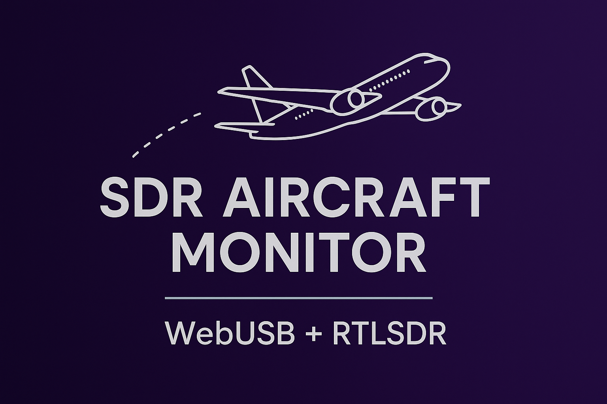

# SDR Aircraft Monitor

A real-time aircraft tracking system using RTL-SDR dongles and WebUSB in the browser. Based on [Charlie Gerard's JavaScript Aircraft Radar System](https://github.com/charliegerard/webusb-rtlsdr-aircraft-radar-system).

Built with Vue 3 and Tailwind CSS, and is intended as a "no build step" type of app - just serve the files and go.



## Requirements

### Hardware

- **RTL-SDR USB dongle** (RTL2832U + R820T/R820T2 tuner recommended)
- **1090MHz antenna** for ADS-B reception

### Software

- **WebUSB-compatible browser** (Chrome 61+, Edge 79+, Opera 48+)
- **Note**: Firefox does not support WebUSB

### API Keys

- **Mapbox access token** (free tier available) for map visualization

## Quick Start

1. **Clone the repository**

   ```bash
   git clone git@github.com:indeox/sdr-aircraft-monitor.git
   cd sdr-aircraft-monitor
   ```

2. **Configure Mapbox token**

   - Sign up at [Mapbox](https://www.mapbox.com/) and get a free access token
   - Edit `index.html` and add your token to the CONFIG section:

   ```javascript
   window.CONFIG = {
     MAPBOX_ACCESS_TOKEN: "your_mapbox_token_here",
   };
   ```

3. **Serve the files**

   ```bash
   # Using Python
   python -m http.server 8000

   # Using Node.js
   npx serve .
   ```

4. **Connect RTL-SDR and open browser**
   - Plug in your RTL-SDR dongle with 1090MHz antenna
   - Navigate to `http://localhost:8000`
   - Click "Connect" and grant USB permissions

## Acknowledgments

- [Many thanks to /u/Ok_Message2748/ for helping with adding & testing R820T/R828D (V4) support 💜](https://www.reddit.com/r/rtl_sdr/comments/1500000/comment/k1000000000000000000000000000000000000000/)
- [Charlie Gerard's JavaScript Aircraft Radar System](https://github.com/charliegerard/webusb-rtlsdr-aircraft-radar-system)
- [Mode S and ADS-B decoding reference](https://mode-s.org/1090mhz/content/ads-b/3-airborne-position.html)
